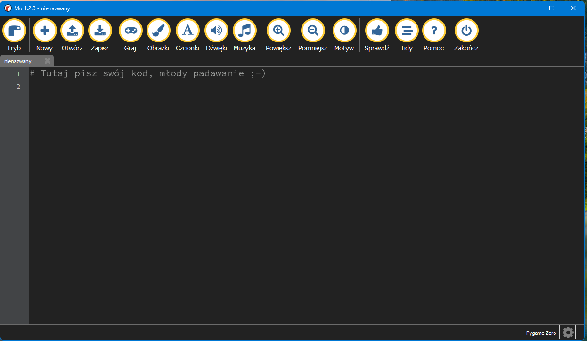

# 13 Podstawy Pygame.

## Co to jest Pygame?
Pygame - jest to bilioteka przeznaczona do tworzenia gier komputerowych oraz aplikacji multimedialnych w języku Python. Dzięki biliotece Pygame możemy tworzyć gry, które posiadają graficzny interfejs użytkownika (GUI).

## Edytor wykorzystywany do tworzenia gier z wykorzystaniem bilioteki pygame.

Aby zacząć programować otwieramy edytor, który nazywa się `Mu Editor`.


Wyświetli się okienko, w którym możemy zacząć tworzyć nasze gry w języku Python.



## Tworzymy okna gry.

Podstawą tworzenia naszych gier będzie stworzenie okna, w którym będziemy mogli umieszczać kolejne stworzone przez nas obiekty. Aby utworzyć okno musimy zaimportować bibliotekę **pygame**. Kolejne polecenie `pygame.init()` służy do zainicjowania róznych modułów wykorzystywanych w naszych grach. Następnie definiujemy nasze okno, które będzie miało wymiary 500 na 500 pikseli. Na sam koniec możemy utworzyć nazwę naszej gry.

Następnie

```python
import pygame

pygame.init()

# definiowanie okna gry
screen = pygame.display.set_mode((500, 500))

# wyświetlenie okna gry
pygame.display.set_caption("Moja Gra")
```

Aby sprawdzić jak działa napisany przez nas kod klikamy przycisk **Graj**


Następnie zapisujemy plik w wybranym przez nas miejscu na komputerze, możemy zapisać plik np. na pulpicie.


Wyświetli się okno, które może być widoczne przez chwilę, lub tak jak na poniższym zdjęciu będzie wyświetlone przez cały czas.


Aby nasze okno było cały czas wyświetlane musimy zastosować pętlę, która będzie powodowała, że nasze okno będzie cały czas otwarte.

```python
run = True
# pętla główna
while run:
    # obsługa zdarzeń  
    for event in pygame.event.get():
        if event.type == pygame.QUIT:
            run = False
```

Sprawdzając warunek `event.type == pygame.QUIT:` sprawdzamy, czy typ zdarzenia jest równy QUIT, czyli naciśnięcie przycisku X na oknie. Jeśli warunek zostanie spełniony nasza pętla zakończy się, a nasze okno przetanie działać.


## Cały kod
```python
import pygame

pygame.init()

# definiowanie okna gry
screen = pygame.display.set_mode((500, 500))

# wyświetlenie okna gry
pygame.display.set_caption("Moja Gra")

run = True
# pętla główna
while run:
    # obsługa zdarzeń  
    for event in pygame.event.get():
        if event.type == pygame.QUIT:
            run = False
```

## Zadanie 1.
Utwórz okno, które będzie miało wymiary 600 px długości i 400 px szerokości. Tytuł wyświetlany w oknie to "Academia Robotica". Stwórz pętlę, która nie będzie pozwalała na zamknięcie okna.

## Rysujemy prostokąt

Aby narysować prostokąt definiujemy jego kolor, wymiary oraz położenie w którym chcemy go narysować. Następnie w pętli umieszczamy metodę `pygame.draw.rect()`, która narysuje prostokąt w naszym oknie. Aby zobaczyć nasz prostokąt musimy odświeżyć nasz ekran poleceniem `pygame.display.update()`

```python
import pygame

pygame.init()

# definiowanie okna gry
screen = pygame.display.set_mode((500, 500))

# wyświetlenie okna gry
pygame.display.set_caption("Moja Gra")

run = True
# pętla główna
while run:
    # obsługa zdarzeń  
    for event in pygame.event.get():
        if event.type == pygame.QUIT:
            run = False
            
    pygame.draw.rect(screen, (255, 0, 0), (0,0, 100, 100))
    pygame.display.update()
```


Co oznaczają kolejne opcje w metodzie pygame.draw.rect?</br>
`pygame.draw.rect(Ekran, Kolor w formacie RGB(R, G, B), (x, y, szerokość, wysokość))`

## Rysujemy koło
Możemy także narysować koło.

```python
pygame.draw.circle(screen, (128, 0, 128), (60, 200), 50, 0)
```
gdzie kolejne opcje oznaczają **(okno, kolor, współrzędne, średnica koła, wypełnienie koła(gdy będziemy podawali wartości większe od 0 oznaczją one grubość linii je otaczającej) )**


## Rysujemy linię

```python
# linia pozioma
pygame.draw.line(screen, (255,0,0), (10, 325), (110, 325), 15)
# linia pionowa
pygame.draw.line(screen, (255,0,0), (210, 275), (210, 375), 5)
```
gdzie kolejne opcje oznaczają **(okno, kolor, współrzędne_początkowe, współrzędne_końcowe , grubość_lini)**


## Tekst
```python
font = pygame.font.SysFont('roboto', 40)
label = font.render('Academia Robotica', True, (255, 0, 255))
screen.blit(label, (100, 425))
```

gdzie w pierwszej kolejnoś☻ci definiujemy czcionkę i rozmiar tekstu. Nstępnie Podajemy nasz tekst i jego kolor. Na sam koniec wypisujemy nasz tekst w podanej lokalizacji.


> [!NOTE]
> Highlights information that users should take into account, even when skimming.

> [!TIP]
> Optional information to help a user be more successful.

> [!IMPORTANT]
> Crucial information necessary for users to succeed.

> [!WARNING]
> Critical content demanding immediate user attention due to potential risks.

> [!CAUTION]
> Negative potential consequences of an action.


