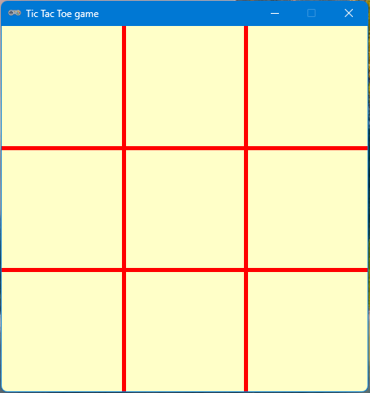

# 13 Tic Tac Toe.

Tworzymy grę kółko i krzyżyk (ang. tic tac toe) w pygame. Pierwszym naszym zadaniem będzie podstawowy program tworzący okno gry.

## Zadanie 1.
Utwórz okno o wymiarach 450x450 px. Tytuł wyświetlany w oknie to "Gra Tic Tac Toe". 

## Zadanie 2.
Napisz funkcję o nazwie **draw_grid**. Narysuj siatkę planszy naszej gry. Powinna ona wyglądać jak na poniższym przykladzie. Pamiętaj, że okno ma wymiary 450x450.



## Dodajemy tablicę zapisującą jaka figura jest w danym polu.
Na początku nasza tablica będzie wyzerowana. W następnych etapach tworzenia gry będziemy podstawiali odpowiednią figurę po kliknięciu w dane pole.

```python
plansza = [[0,0,0], [0,0,0],[0,0,0]]
```
## Dodajemy obsługę zdarzenia kliknięcia myszką
W pętli głównej naszego programu dodajemy dwie instrukcje warunkowe sprawdzające, czy przycisk został wciśnięty oraz czy przycisk został puszczony.

```python
clicked = False

while run:
    
    draw_grid()
    
    # obsługa zdarzeń  
    for event in pygame.event.get():
        if event.type == pygame.QUIT:
            run = False
        #sprawdzenie zdarzenia wciśnięcia przycisku myszy   
        if event.type == pygame.MOUSEBUTTONDOWN:
            clicked = True
        #sprawdzenie zdarzenia puszczenia przycisku myszy    
        if event.type == pygame.MOUSEBUTTONUP and clicked == True:
            clicked = False
            
    pygame.display.update()
```
Możemy także dodać instrukcję **print** aby zobaczyć działanie zdarzeń.

```python
clicked = False

while run:
    
    draw_grid()
    
    # obsługa zdarzeń  
    for event in pygame.event.get():
        if event.type == pygame.QUIT:
            run = False
            
        if event.type == pygame.MOUSEBUTTONDOWN:
            clicked = True
            print(clicked)
            
        if event.type == pygame.MOUSEBUTTONUP and clicked == True:
            clicked = False
            print(clicked)
            
    pygame.display.update()

pygame.quit()
```

## Przechwytujemy pozycję kursora
Kiedy puszczamy nasz przycisk myszki chcielibyśmy pobrać pozycję, gdzie znajduje się  kursor. A więc spróbujmy to wykonać.

Po pierwsze dodajmy zmienną, w której będziemy przechowywali dane o pozycji kursora. Wystarczy aby była to pusta tablica.

```python
pos = []
```
Następnie w naszej naszej instrukcji warunkowej sprawdzającej czy przycisk myszy został puszczony, dodajemy pobieranie aktualnej pozycji kursora myszy.

```python
clicked = False
pos = []
while run:
    
    draw_grid()
    
    # obsługa zdarzeń  
    for event in pygame.event.get():
        if event.type == pygame.QUIT:
            run = False
            
        if event.type == pygame.MOUSEBUTTONDOWN:
            clicked = True
            
        if event.type == pygame.MOUSEBUTTONUP and clicked == True:
            clicked = False
            pos = pygame.mouse.get_pos()
            pos_x = pos[0]
            pos_y = pos[1]
            
    pygame.display.update()
```
Warto także wypisać instrukcją print pozycje i sprawdzić czy funkcja działa.

## Zadanie 3.
W podanej instrukcji warunkowej sprwadź czy w tablicy plansza wartość jest równa zero. Jeśli wartość jest równa zero wstaw znacznik aktualnego gracza. Przy sprawdzaniu tablicy plansza możesz wykorzystać dzielenie // (wynik jako liczba całkowita)
